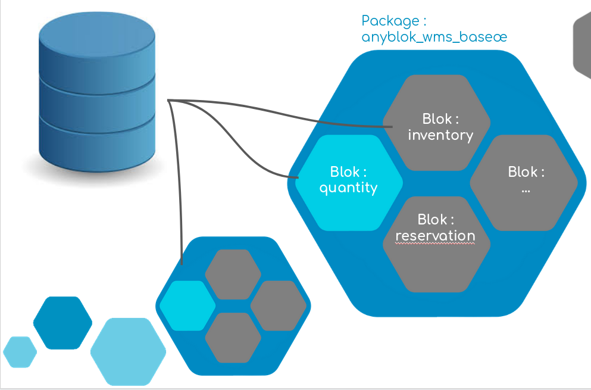

## Set up your own project

In this chapter you will learn how to start an Anyblok project ready to
run and hack.

### Project initialization

To quickly set up a new project we maintain [a cookie cutter recipe]
[cookiecutter] which helps you generate a new AnyBlok project by
answering a few questions.

As you take any good opportunity to innovate (and mainly because we would like
to show you some AnyBlok concepts), after talking with your customers it
feels like booking a classroom looks a lot like reserving a meeting room in
any company. For now, it won't change a lot of things but later we will
demonstrate how to split your code in different Bloks.
So let's call this project **rooms booking** and create a first blok
named ``room``.

```bash
(rooms-venv)$ pip install cookiecutter
(rooms-venv)$ cookiecutter gh:AnyBlok/cookiecutter-anyblok-project
project_name [Project name]: Rooms booking
project_slug [rooms-booking]:
project_short_description [A short description of the Anyblok based project]: Anyblok service to manage (class)rooms reservation
python_package [rooms_booking]:
blok_name [rooms_booking]: room
Select db_driver_name:
1 - postgresql
2 - mysql
Choose from 1, 2 (1, 2) [1]:
db_name [rooms_booking]:
Select http_server:
1 - no
2 - anyblok_pyramid
3 - anyblok_pyramid+beaker
4 - anyblok_pyramid+gunicorn
5 - anyblok_pyramid+beaker+gunicorn
Choose from 1, 2, 3, 4, 5 (1, 2, 3, 4, 5) [1]: 2
Select has_anyblok_marshmallow:
1 - no
2 - yes
Choose from 1, 2 (1, 2) [1]:
Select open_source_license:
1 - Mozilla Public License Version 2.0
2 - GNU General Public License v3
3 - MIT license
4 - BSD license
5 - ISC license
6 - Apache Software License 2.0
7 - Not open source
Choose from 1, 2, 3, 4, 5, 6, 7 (1, 2, 3, 4, 5, 6, 7) [1]:
version [0.1.0]:
full_name [Your name]: Pierre Verkest
email [Your address email (eq. you@example.com)]: pverkest@anybox.fr
github_username [Your github username]: petrus-v
```

Congratulations! Your project is there, you have created a ``rooms-booking``
directory with a blok called ``room`` and an ``Example`` model is present inside.


### Set up your environment

**Note:** We assume you have at least a python3.6 environment ready to work
with and Postgresql listening on port 5432.

We have a project directory but before running Anyblok you need
to get dependencies like AnyBlok itself and setup a database:

```bash
(rooms-venv)$ cd rooms-booking
(rooms-venv)$ make setup-dev
```

You can read the [Makefile][makefile-setup-dev] to understand what's done:

```bash
setup-dev: ## install python project dependencies for development
    pip install -r requirements.dev.txt
    python setup.py develop
    anyblok_createdb -c app.dev.cfg || anyblok_updatedb -c app.dev.cfg
```

- We have installed dev requirements
- Installed current package using ``develop`` that allows you to develop and run
  your package without re-installing it after each changes
- Create (or update) a database with ``room`` blok installed with all
  its requirements

As you may have noticed, the state saying what bloks are installed or not
is saved in a database, so you can have two different databases working
with the same code that behave in a different way according to installed bloks.





### Run your project

As long as you chose ``anyblok_pyramid``, you have two options. We will start
to open a console interpreter to add *Example* records in your database then
we are going to list them in your preferred browser and see how to launch
unittests.


#### Console interpreter

This shows you how to add and query the Example model using [ipython](
https://ipython.org/index.html):

```python
(rooms-venv)$ anyblok_interpreter -c app.dev.cfg

In [1]: registry.Example.query().all()
Out[1]: [<Example: An example, 1>]

In [2]: registry.Example.query().all().name
Out[2]: ['An example']

In [3]: registry.Example.insert(name="Another example")
Out[3]: <Example: Another example, 2>

In [4]: registry.Example.query().all()
Out[4]: [<Example: An example, 1>, <Example: Another example, 2>]

In [5]: registry.Example.query().all().name
Out[5]: ['An example', 'Another example']

In [7]: registry.commit()

In [8]: exit
```

### Run webserver

To run a development webserver execute:

```bash
(rooms-venv)$ make run-dev
anyblok_pyramid -c app.dev.cfg --wsgi-host 0.0.0.0
AnyBlok Load init: EntryPoint.parse('anyblok_pyramid_config = anyblok_pyramid:anyblok_init_config')
Load config file '/etc/xdg/AnyBlok/conf.cfg'
Load config file '~/.config/AnyBlok/conf.cfg'
Load config file '~/AnyBlok/rooms-booking/app.dev.cfg'
Load config file '~/AnyBlok/rooms-booking/app.cfg'
```

Then open your favorite web browser and visit following urls:

```bash
$ curl localhost:8080/
<a href="./example">List all availaible examples</a><br/>
<a href="./example/1">Get example id=1</a>

$ curl 127.0.0.1:8080/example
[{"id": 1, "name": "An example"}, {"id": 2, "name": "Another example"}]

$ curl localhost:8080/example/1
An example
```

> **Tips**: you can use ``ctrl+C`` to kill the server

### Run tests

Before running tests, you'll have to configure the tests environment, we usually
use a different database to launch unittests as some tests may depend on
some expected demo data that we don't want to alter while testing manually!

```bash
(rooms-venv)$ make setup-tests
(rooms-venv)$ make test
========================================== test session starts ==========================================
platform linux -- Python 3.5.3, pytest-4.6.3, py-1.8.0, pluggy-0.12.0 -- ~/anyblok/venvs/rooms-venv/bin/python3
cachedir: .pytest_cache
rootdir: ~/anyblok/rooms-booking, inifile: tox.ini
plugins: cov-2.7.1
collecting ... AnyBlok Load init: EntryPoint.parse('anyblok_pyramid_config = anyblok_pyramid:anyblok_init_config')
Loading config file '/etc/xdg/AnyBlok/conf.cfg'
Loading config file '~/.config/AnyBlok/conf.cfg'
Loading config file '~/anyblok/rooms-booking/app.test.cfg'
Loading config file '~/anyblok/rooms-booking/app.cfg'
Loading config file '/etc/xdg/AnyBlok/conf.cfg'
Loading config file '~/.config/AnyBlok/conf.cfg'
collected 5 items                                                                                       

rooms_booking/room/tests/test_model.py::TestExample::test_create_example AnyBlok Load init: EntryPoint.parse('anyblok_pyramid_config = anyblok_pyramid:anyblok_init_config')
Loading config file '/etc/xdg/AnyBlok/conf.cfg'
Loading config file '~/.config/AnyBlok/conf.cfg'
PASSED
rooms_booking/room/tests/test_pyramid.py::TestPyramidExampleViews::test_root PASSED
rooms_booking/room/tests/test_pyramid.py::TestPyramidExampleViews::test_examples PASSED
rooms_booking/room/tests/test_pyramid.py::TestPyramidExampleViews::test_get_example PASSED
rooms_booking/room/tests/test_pyramid.py::TestPyramidExampleViews::test_post_example PASSED

=========================================== warnings summary ============================================
rooms_booking/room/tests/test_model.py::TestExample::test_create_example
  ~/anyblok/venvs/rooms-venv/lib/python3.5/site-packages/SQLAlchemy-1.3.5-py3.5-linux-x86_64.egg/sqlalchemy/pool/impl.py:96: SADeprecationWarning: PoolListener is deprecated in favor of the PoolEvents listener interface.  The Pool.listeners parameter will be removed in a future release.
    Pool.__init__(self, creator, **kw)

-- Docs: https://docs.pytest.org/en/latest/warnings.html

----------- coverage: platform linux, python 3.5.3-final-0 -----------
Coverage HTML written to dir htmlcov

================================= 5 passed, 1 warnings in 2.23 seconds ==================================
```

We have learned how to bootstrap an AnyBlok project and run it without explaining
what each component is, if you want to go further keep reading!


[cookiecutter]: https://github.com/AnyBlok/cookiecutter-anyblok-project
[makefile-setup-dev]: https://github.com/AnyBlok/anyblok-book-examples/blob/master/II_setup-project/Makefile#L29-L33
